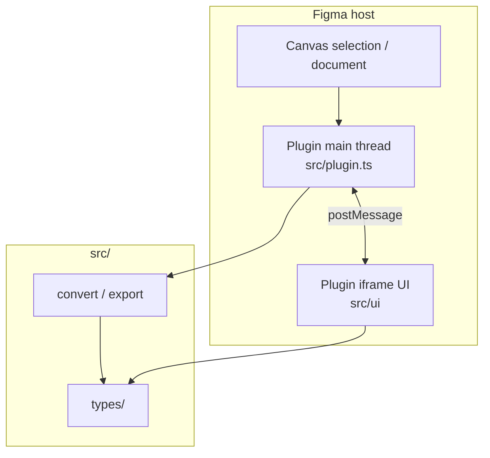
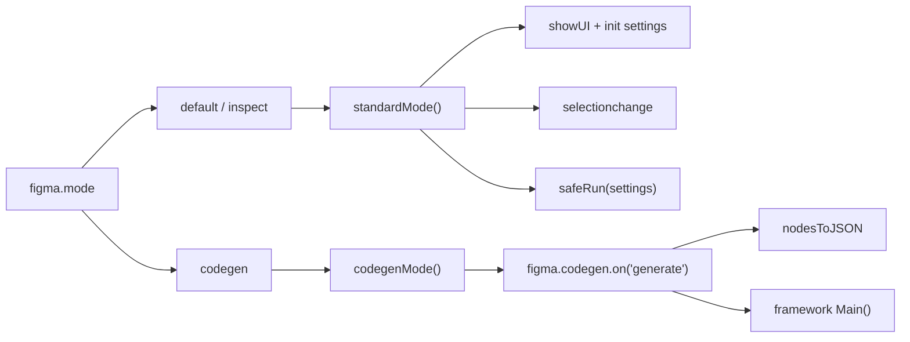
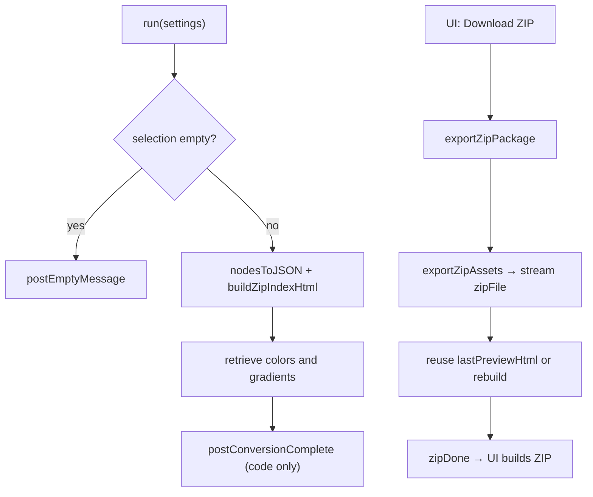
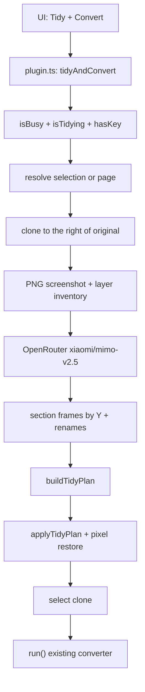
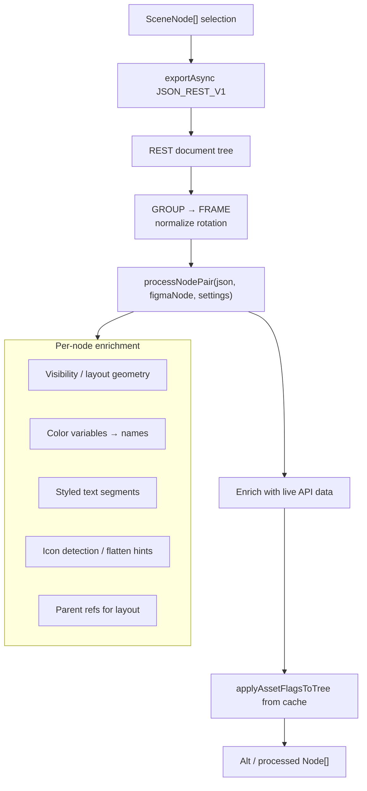
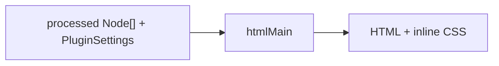
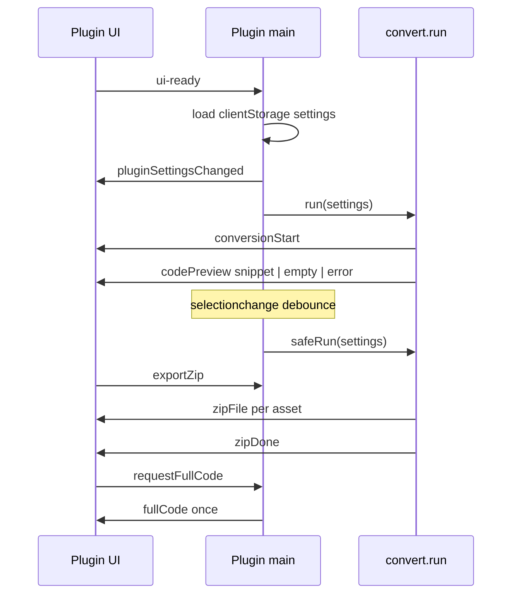
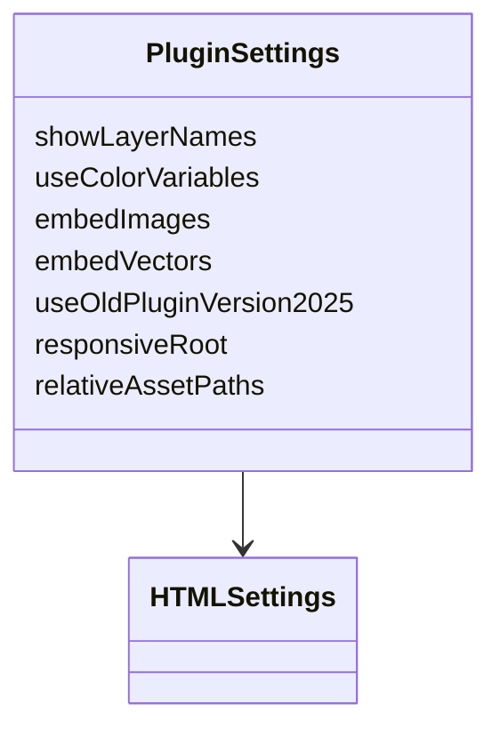
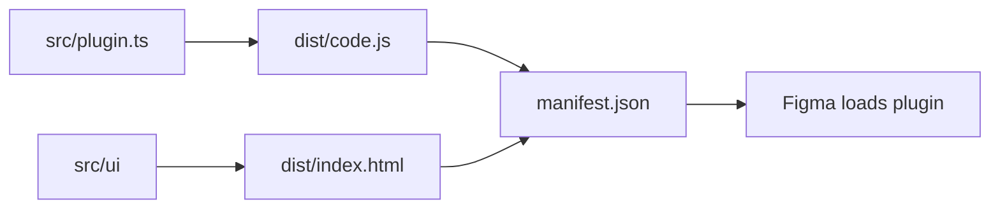
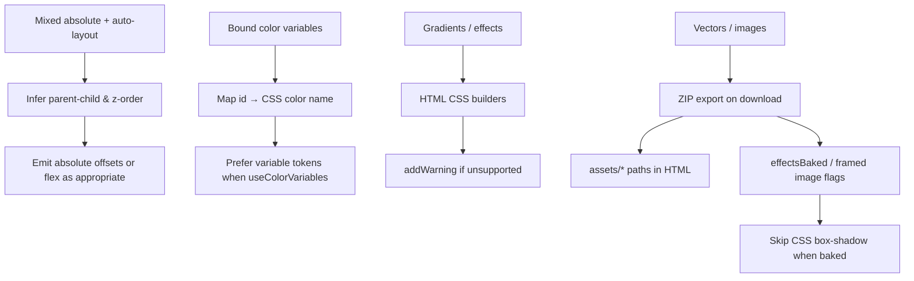

# Logic

How Figma to Code turns a Figma selection into HTML + CSS **and** a downloadable ZIP of JSON + assets. This document describes the runtime pipeline and messaging — not setup steps (see [Developer Guide](./user-guide.md)).

---

## High-level architecture



| Path            | Role                                                              |
| --------------- | ----------------------------------------------------------------- |
| `src/plugin.ts` | Entry: settings, selection listeners, codegen mode, calls `run()` |
| `src/convert/`  | Node processing + HTML + CSS emitter                              |
| `src/export/`   | Asset ZIP                                                         |
| `src/tidy/`     | Clone + AI sections + Auto Layout tidy before convert             |
| `src/ui/`       | Panel: code, ZIP download, colors                                 |
| `src/types/`    | Shared `PluginSettings`, messages, and node types                 |

---

## Plugin modes

Figma launches the plugin in different modes (`figma.mode`).



- **default / inspect** — visible panel; ZIP + live conversion on selection and setting changes.
- **codegen** — Dev Mode languages from `manifest.json`; returns `CodegenResult[]` (code + extras). Codegen path does not build the ZIP package.

---

## End-to-end conversion pipeline

Core orchestration lives in `src/convert/run.ts` (`run`).



Selection / settings changes run **code preview only** (planned `assets/*` paths, no `exportAsync` for images). Asset bytes stream to the UI **only when the user clicks Download ZIP**. The panel receives an HTML snippet; the full document stays in the main thread.

### ZIP package

```text
export.zip
  index.html          # Static HTML preview (relative asset URLs)
  figma_raw.json      # REST-shaped tree for offline use
  assets_map.json     # node id → asset path + flags
  assets/*.{svg,png}
```

Open `index.html` after extracting the ZIP to view a design-faithful HTML render that loads images/SVGs from `assets/`.

Accuracy rules (ported for fidelity):

| Rule                     | Behavior                                                         |
| ------------------------ | ---------------------------------------------------------------- |
| IMAGE fills              | Framed `exportAsync` PNG (not CSS `background-image` alone)      |
| Vectors / shapes / icons | Baked SVG (`exportAsync` SVG)                                    |
| Effects on export        | Unclip ancestors while exporting; mark `effectsBaked`            |
| Conversion reuse         | Preview plans paths only; ZIP streams each file then drops bytes |
| CSS shadows              | Skip `box-shadow` when `effectsBaked` so shadows are not doubled |

UI: **Download ZIP** streams one file per `zipFile` message; `src/ui/zip.ts` builds the archive on `zipDone` and clears the buffers.

`safeRun` serializes runs (`isBusy`). Selection changes are debounced (~400ms). `documentchange` is not registered because `documentAccess: "dynamic-page"` would require `figma.loadAllPagesAsync()` first.

---

## Tidy + Convert (Phase 1 + AI vision)

Button-only path (`tidyAndConvert`). Does **not** run on every `selectionchange`.

Requires an **OpenRouter API key** (About panel → saved in `figma.clientStorage` as `openRouterApiKey`). Manifest allows `https://openrouter.ai` only.



### Behavior

1. Resolves target: current selection, or (if empty) all visible top-level layers on the current page.
2. Clones onto the current page, placed to the right of the original bbox (`gap = 80`). Name: `{original} / tidied`.
3. Plugin data links source ↔ clone (`tidySourceId` / `tidyCloneId`). Re-running replaces the previous clone.
4. Captures a PNG of the clone + compact inventory; calls OpenRouter vision for `splitLinesY`, section names, and renames.
5. Assigns **direct children** to sections by center Y (geometry), creates section frames, applies renames.
6. Infers Auto Layout on freeform structure (pixel-preserve revert if layout drifts); original is untouched.
7. Selects the clone and runs the normal HTML converter.

### AI failure modes

| Case                  | Behavior                                            |
| --------------------- | --------------------------------------------------- |
| No API key            | Error; Tidy button disabled in UI                   |
| OpenRouter HTTP error | Abort; remove clone if created                      |
| Invalid model JSON    | Warning; skip AI sections; geometry tidy still runs |
| Fewer than 2 sections | Skip wrappers; geometry tidy only                   |

### Debug console

Console logging is currently disabled. Add selective `console` / `aiLog` calls when you need them.

### Skip rules

| Case                                        | Behavior                                                                 |
| ------------------------------------------- | ------------------------------------------------------------------------ |
| Already Auto Layout (`layoutMode !== NONE`) | Do not change that frame’s layout props; still tidy freeform descendants |
| `INSTANCE`                                  | Keep linked; treat as leaf (no detach, no inner tidy)                    |
| `COMPONENT` main                            | Build a FRAME copy of children (do not mutate the main)                  |
| `GROUP`                                     | Convert to FRAME (or unwrap single-child empty groups), then infer       |
| Rotated / overlapping decorative / overlays | Prefer `layoutPositioning = ABSOLUTE` over a wrong flex stack            |
| Codegen mode                                | No tidy                                                                  |

Inference: `src/tidy/infer.ts`. AI: `src/tidy/ai/`. Writes: `src/tidy/apply.ts`, `src/tidy/clone.ts`, `src/tidy/ai/sections.ts`.

### Phase 2 (not implemented)

Keep `TidyPlan` / infer. Stop showing a canvas sibling — either hide/remove the clone after `nodesToJSON`, or apply the plan onto the REST JSON tree with no canvas write so poor design → structured HTML looks direct.

---

## Node conversion (`nodesToJSON`)

Modern path: `src/convert/nodes/toJson.ts`.



Why two sources?

1. **JSON_REST_V1** — stable serializable tree (fills, layout props, hierarchy).
2. **Live `SceneNode`** — async APIs (`getStyledTextSegments`, variables, export) that REST alone does not fully cover.

Groups are treated as frames; child rotations are adjusted so layout math stays consistent. An older path (`oldConvertNodesToAltNodes`) remains behind `useOldPluginVersion2025` for regression comparison.

**Typing note:** `nodesToJSON` returns REST `Node[]`. Framework emitters are typed for plugin `SceneNode[]`. Call sites bridge with a cast (`as unknown as SceneNode[]` in codegen) or `any` in `run()` — the trees are structurally the same enriched shapes.

---

## HTML + CSS generation

`run` always builds HTML through `htmlMain` with `lockedHtmlSettings` (layer names, color variables, `assets/*` paths). Preview and ZIP `index.html` share that document.



Each `*Main` walks the tree and uses builder modules for:

- Auto layout → flex / stack / row-column
- Freeform → absolute positioning
- Size, padding, border radius
- Fills, strokes, effects, blend
- Text (typography segments)
- Image Base64 / SVG embed (forced on in `run`)

The panel shows **code + ZIP** only. `generateHTMLPreview` may still exist in `generate.ts` for legacy/compat types, but the UI no longer renders an HTML preview.

---

## Messaging contract

UI and main thread talk over `postMessage`. Types live in `src/types/`.



| Direction | `type`                    | Meaning                                             |
| --------- | ------------------------- | --------------------------------------------------- |
| UI → Main | `ui-ready`                | Handshake; init once                                |
| UI → Main | `pluginSettingWillChange` | Preference update                                   |
| UI → Main | `exportZip`               | Start streamed ZIP export                           |
| UI → Main | `tidyAndConvert`          | AI sections + Auto Layout tidy, then convert        |
| UI → Main | `setOpenRouterKey`        | Save OpenRouter API key to clientStorage            |
| UI → Main | `requestFullCode`         | Copy or expand the full HTML document               |
| UI → Main | `get-selection-json`      | Debug dump of REST + conversion                     |
| Main → UI | `pluginSettingsChanged`   | Full settings push                                  |
| Main → UI | `openRouterKeyStatus`     | `{ hasKey }` so UI can enable Tidy + Convert        |
| Main → UI | `conversionStart`         | Loading / status reset                              |
| Main → UI | `progress`                | Status text (tidy or ZIP export)                    |
| Main → UI | `code`                    | HTML snippet + counts (full document stays in main) |
| Main → UI | `zipFile` / `zipDone`     | One ZIP file, then assemble + download              |
| Main → UI | `fullCode`                | One-shot full HTML for copy or Show more            |
| Main → UI | `empty`                   | No selection / nothing convertible                  |
| Main → UI | `error`                   | Fatal user-facing error                             |

The panel does not keep the full HTML or ZIP bytes in React state. `htmlPreview` on the message type is deprecated and unused.

---

## Settings model

`PluginSettings` is HTML-only. Defaults are set in `src/plugin.ts` and persisted in `figma.clientStorage` under `userPluginSettings`.

In `run()`, `embedImages` and `embedVectors` are **forced `true`** so ZIP-backed embeds stay accurate even if UI toggles differ.



Export settings are locked in `src/convert/settings.ts` (layer names on, color variables on, images/vectors as `assets/*`).

---

## Build data flow



esbuild/Vite assemble the plugin into root `dist/`; Figma only loads those artifacts referenced by `manifest.json`.

---

## Hard cases (design decisions)



Warnings are accumulated in a module-level set (`src/convert/warnings.ts`) and returned with the conversion payload so the UI can surface them without failing the whole run.

---

## Key source map

| Concern                 | Location                                     |
| ----------------------- | -------------------------------------------- |
| Plugin entry & modes    | `src/plugin.ts`                              |
| Orchestration `run`     | `src/convert/run.ts`                         |
| Tidy + AI + Auto Layout | `src/tidy/`, `src/tidy/ai/`                  |
| ZIP + asset export      | `src/export/zip.ts`                          |
| Asset cache / flags     | `src/export/cache.ts`, `src/export/flags.ts` |
| JSON → processed nodes  | `src/convert/nodes/toJson.ts`                |
| Static HTML document    | `src/export/html.ts`                         |
| HTML codegen            | `src/convert/html/generate.ts`               |
| Locked export settings  | `src/convert/settings.ts`                    |
| Plugin → UI messages    | `src/messaging.ts`                           |
| Panel + ZIP / Tidy      | `src/ui/PluginUI.tsx`                        |
| ZIP download helper     | `src/ui/zip.ts`                              |
| Types                   | `src/types/`                                 |
