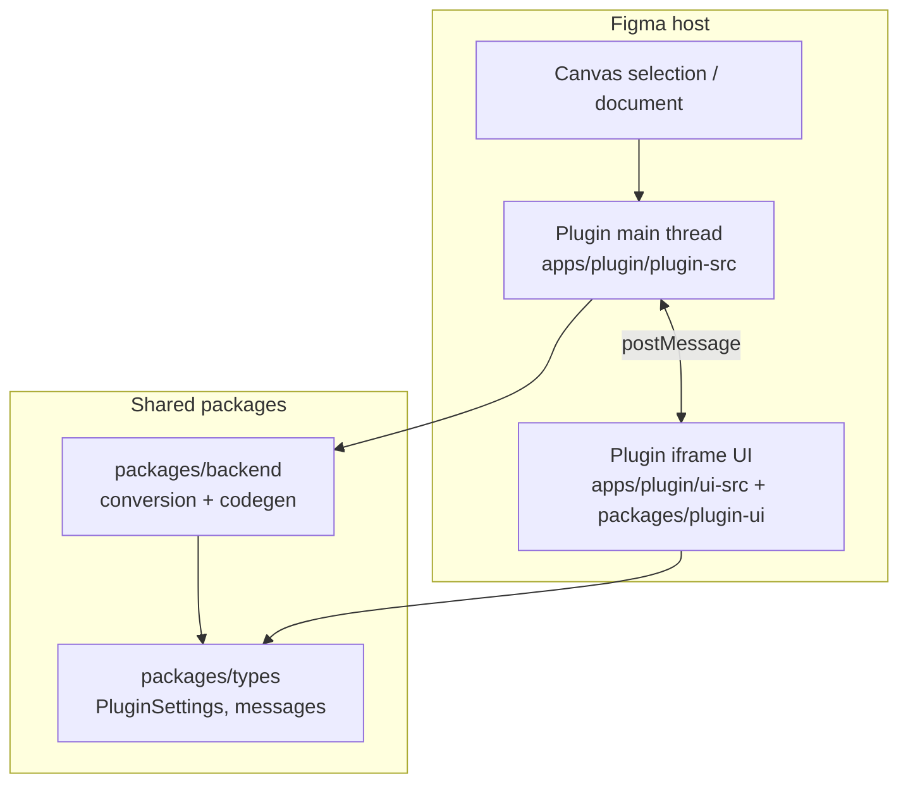
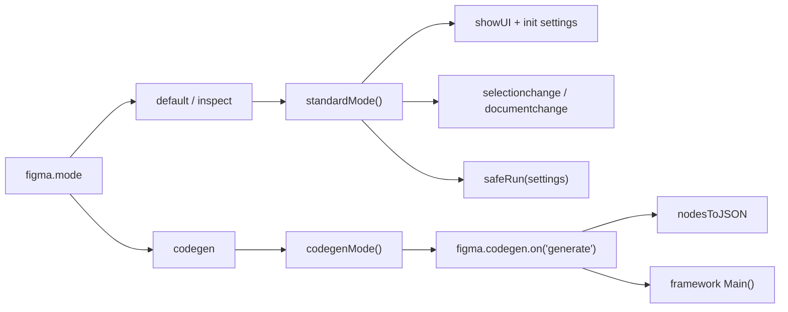
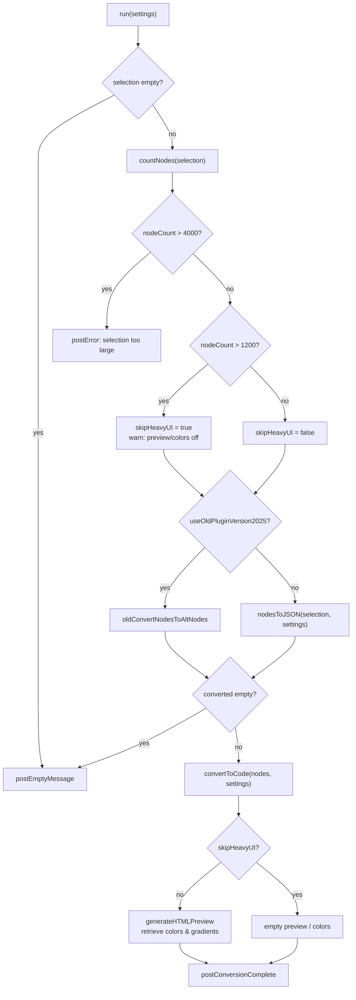
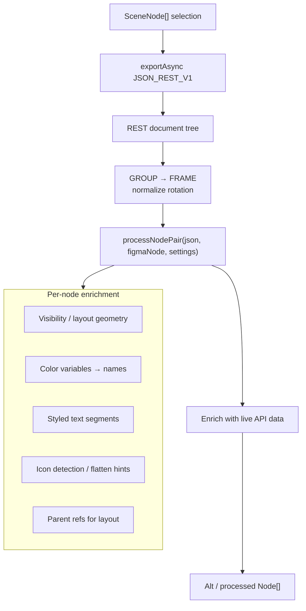
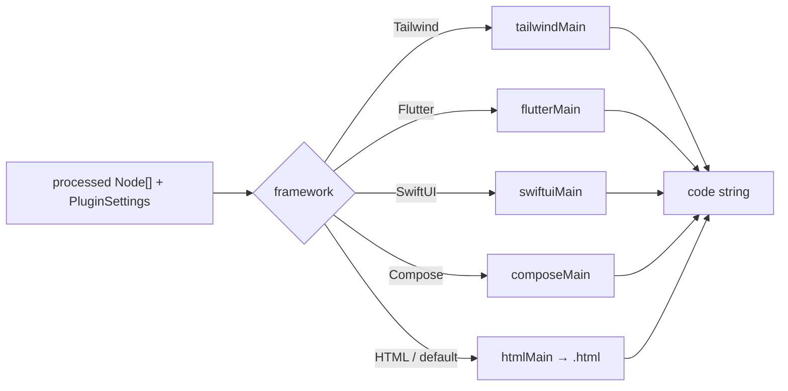
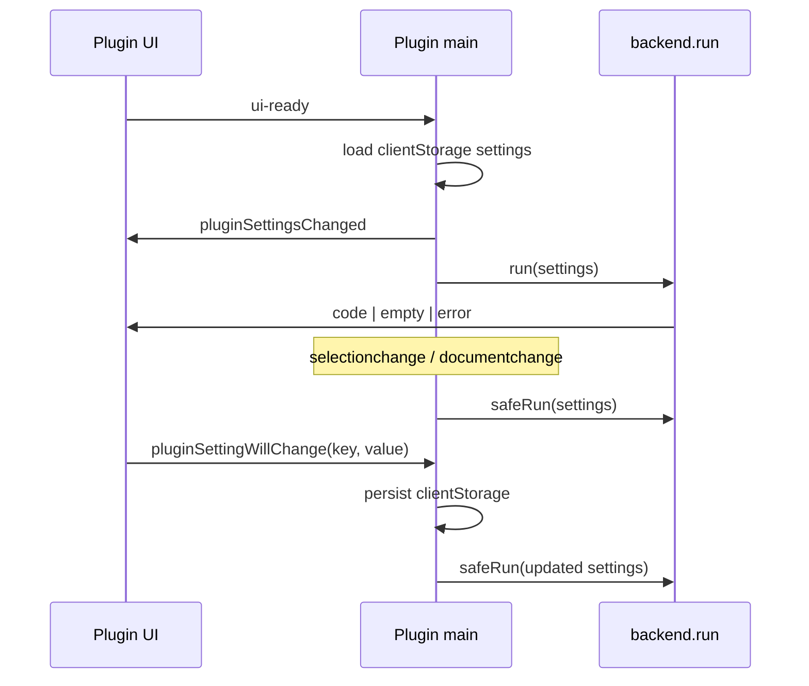
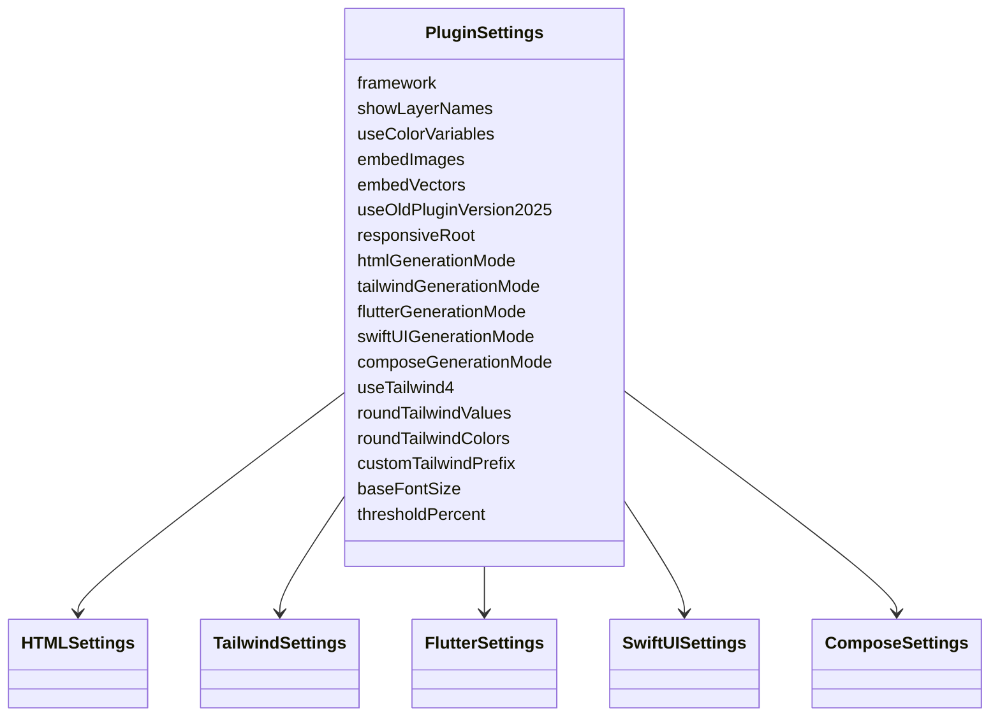
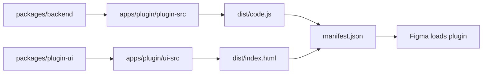
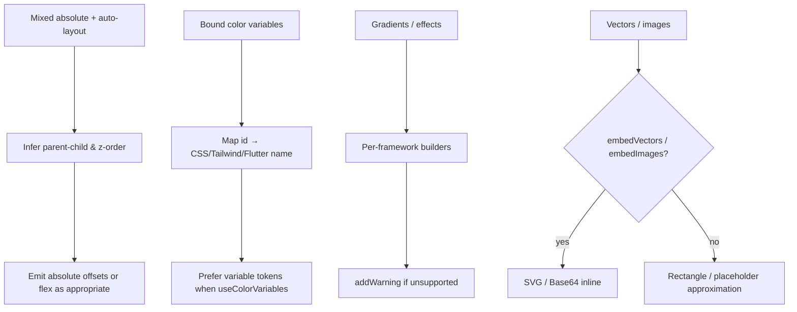

# Logic

How Figma to Code turns a Figma selection into framework-specific source. This document describes the runtime pipeline, packages, and messaging — not setup steps (see [Developer Guide](./user-guide.md)).

---

## High-level architecture

The monorepo splits **Figma sandbox logic**, **shared UI**, and **plugin assembly**.

| Package / app            | Role                                                              |
| ------------------------ | ----------------------------------------------------------------- |
| `apps/plugin/plugin-src` | Entry: settings, selection listeners, codegen mode, calls `run()` |
| `packages/backend`       | Node conversion, layout helpers, per-framework emitters           |
| `packages/plugin-ui`     | Framework tabs, preview, code panel, preferences                  |
| `packages/types`         | Shared `PluginSettings` and message contracts                     |
| `apps/debug`             | Next.js host to exercise the UI without Figma                     |

---

## Plugin modes

Figma launches the plugin in different modes (`figma.mode`).

- **default / inspect** — visible panel; live conversion on selection and setting changes.
- **codegen** — Dev Mode languages from `manifest.json`; returns `CodegenResult[]` (code + extras).

---

## End-to-end conversion pipeline

Core orchestration lives in `packages/backend/src/code.ts` (`run`).

### Size guards

| Threshold | Constant                 | Effect                                    |
| --------- | ------------------------ | ----------------------------------------- |
| 1200      | `MAX_NODE_COUNT_PREVIEW` | Skip HTML preview + color/gradient panels |
| 4000      | `MAX_NODE_COUNT_HARD`    | Abort conversion                          |

`safeRun` in the plugin entry serializes runs (`isLoading`) so temporary visibility toggles during image export do not recurse via `documentchange`.

---

## Node conversion (`nodesToJSON`)

Modern path: `packages/backend/src/altNodes/jsonNodeConversion.ts`.

Why two sources?

1. **JSON_REST_V1** — stable serializable tree (fills, layout props, hierarchy).
2. **Live `SceneNode`** — async APIs (`getStyledTextSegments`, variables, export) that REST alone does not fully cover.

Groups are treated as frames; child rotations are adjusted so layout math stays consistent. An older path (`oldConvertNodesToAltNodes`) remains behind `useOldPluginVersion2025` for regression comparison.

---

## Framework dispatch

`convertToCode` routes by `settings.framework`:

Each `*Main` walks the tree and uses builder modules for:

- Auto layout → flex / stack / row-column
- Size, padding, border radius
- Fills, strokes, effects, blend
- Text (typography segments)
- Optional image Base64 / SVG embed

HTML also drives the **preview** (`generateHTMLPreview`) independently of the selected framework’s code string.

---

## Messaging contract

UI and main thread talk over `postMessage`. Types live in `packages/types`.

| Direction | `type`                    | Meaning                              |
| --------- | ------------------------- | ------------------------------------ |
| UI → Main | `ui-ready`                | Handshake; init once                 |
| UI → Main | `pluginSettingWillChange` | Preference update                    |
| UI → Main | `get-selection-json`      | Debug dump of REST + conversion      |
| Main → UI | `pluginSettingsChanged`   | Full settings push                   |
| Main → UI | `code`                    | Conversion result (`ConversionData`) |
| Main → UI | `empty`                   | No selection / nothing convertible   |
| Main → UI | `error`                   | Fatal user-facing error              |

---

## Settings model

`PluginSettings` merges framework-specific fields. Defaults are set in `apps/plugin/plugin-src/code.ts` and persisted in `figma.clientStorage` under `userPluginSettings`.

Preference toggles in the UI are filtered by `includedLanguages` in `codegenPreferenceOptions.ts`, so only options relevant to the active framework appear.

---

## Monorepo data flow (build)

Turborepo + esbuild/Vite assemble the plugin; Figma only loads the built `apps/plugin/dist` artifacts referenced by `manifest.json`.

---

## Hard cases (design decisions)

Warnings are accumulated in a module-level set (`commonConversionWarnings`) and returned with the conversion payload so the UI can surface them without failing the whole run.

---

## Key source map

| Concern                | Location                                                  |
| ---------------------- | --------------------------------------------------------- |
| Plugin entry & modes   | `apps/plugin/plugin-src/code.ts`                          |
| Orchestration `run`    | `packages/backend/src/code.ts`                            |
| JSON → processed nodes | `packages/backend/src/altNodes/jsonNodeConversion.ts`     |
| Framework switch       | `packages/backend/src/common/retrieveUI/convertToCode.ts` |
| HTML / preview         | `packages/backend/src/html/htmlMain.ts`                   |
| Tailwind               | `packages/backend/src/tailwind/tailwindMain.ts`           |
| Flutter                | `packages/backend/src/flutter/flutterMain.ts`             |
| SwiftUI                | `packages/backend/src/swiftui/swiftuiMain.ts`             |
| Compose                | `packages/backend/src/compose/composeMain.ts`             |
| Backend → UI messages  | `packages/backend/src/messaging.ts`                       |
| Shared UI              | `packages/plugin-ui/src/PluginUI.tsx`                     |
| Preference definitions | `packages/plugin-ui/src/codegenPreferenceOptions.ts`      |
| Types                  | `packages/types/src/types.ts`                             |
