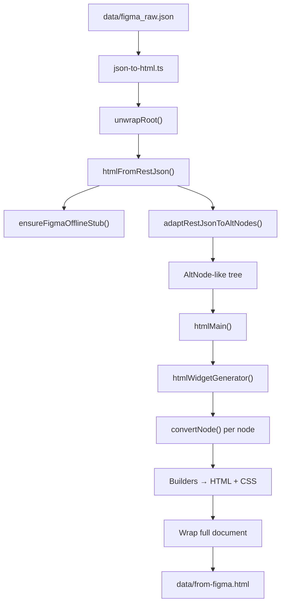
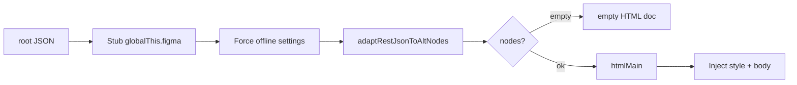
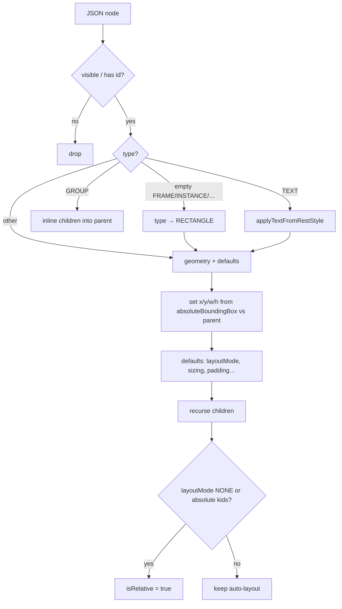
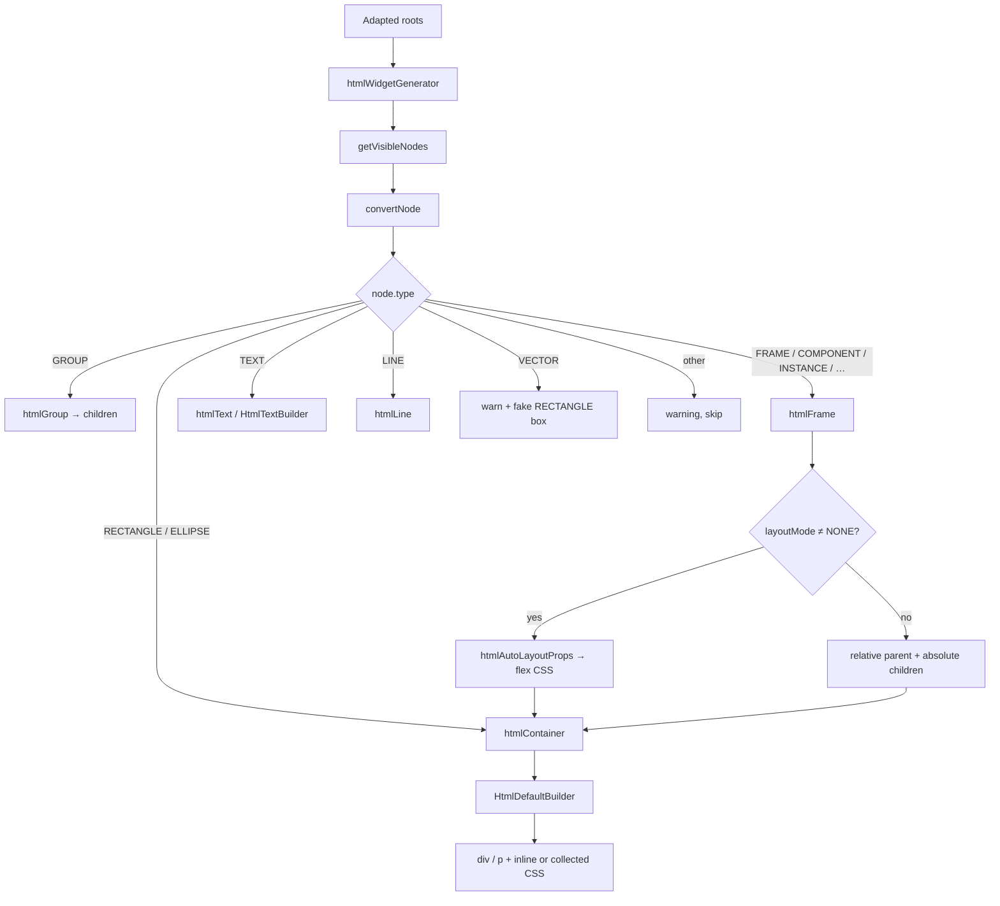

# Figma layout tools

Standalone package for inspecting Figma REST / `JSON_REST_V1` dumps and converting them to HTML — no Figma plugin, and **no imports from `packages/*`**.

All conversion logic lives under this folder (`lib/` + local `types/`).

## Setup

From the **repo root** (workspace includes `tools/*`):

```bash
pnpm install
```

Or from this directory:

```bash
cd tools/figma-layout
pnpm install
```

## Quick start

```bash
# 1. Put a dump here
#    tools/figma-layout/data/figma_raw.json

# 2. Layout-only JSON (optional)
pnpm layout:filter

# 3. HTML
pnpm layout:html
# → tools/figma-layout/data/from-figma.html
```

Same commands from inside this directory: `pnpm filter` / `pnpm html`.

---

## Layout

```text
tools/figma-layout/
├── filter-layout.js       # raw JSON → size/position-only JSON
├── layout-rects.html      # canvas viewer for absoluteBoundingBox rects
├── json-to-html.ts        # CLI: raw JSON → HTML
├── lib/                   # vendored offline HTML converter (self-contained)
│   ├── html/              # htmlMain, builders, htmlFromRestJson
│   ├── altNodes/          # adaptRestJson (+ helpers)
│   └── common/            # shared helpers used by HTML path
├── types/                 # local PluginSettings / AltNode types
├── package.json
├── tsconfig.json
├── README.md
└── data/                  # local dumps (*.json / *.html gitignored)
    ├── figma_raw.json
    ├── figma_layout.json
    └── from-figma.html
```

---

## 1. Put a Figma JSON dump in `data/`

Use REST-style JSON (same shape as plugin `exportAsync({ format: "JSON_REST_V1" }).document`).

Supported root shapes:

- A single node (`{ id, name, type, children, absoluteBoundingBox, … }`)
- `{ document: { … } }`
- `{ nodes: { "<id>": { document: { … } } } }` (HTML CLI uses the first entry)

---

## 2. Filter to layout-only JSON

Keeps `id`, `type`, children, and geometry / auto-layout fields. Drops fills, text, effects, etc.

```bash
# from repo root
pnpm layout:filter

# from this directory
pnpm filter

# custom paths (cwd does not matter; paths are resolved)
node filter-layout.js path/to/in.json path/to/out.json
```

Default: `data/figma_raw.json` → `data/figma_layout.json`.

---

## 3. View layout as rectangles

`layout-rects.html` fetches `./data/figma_layout.json` and draws every `absoluteBoundingBox`.

| Action | Behavior                                                       |
| ------ | -------------------------------------------------------------- |
| Hover  | Yellow highlight + tooltip (`type`, `id`, x/y, w×h)            |
| Click  | Copies `id` to clipboard; rect flashes red while mouse is down |

Serve this folder (`file://` cannot `fetch` JSON):

```bash
# from repo root
pnpm layout:serve

# from this directory
pnpm serve
```

Open: [http://localhost:8765/layout-rects.html](http://localhost:8765/layout-rects.html)

Refresh after editing `figma_layout.json` (fetch uses `cache: "no-store"`).

---

## 4. Generate HTML from raw JSON

```bash
# from repo root
pnpm layout:html

# from this directory
pnpm html

# custom in / out
pnpm html -- data/figma_raw.json data/from-figma.html
```

Default: `data/figma_raw.json` → `data/from-figma.html`.

Use **raw** JSON here (fills, text, effects). `figma_layout.json` is for the rect viewer only.

### End-to-end flow



| Step  | File                                                                    | Role                                                                    |
| ----- | ----------------------------------------------------------------------- | ----------------------------------------------------------------------- |
| CLI   | `json-to-html.ts`                                                       | Read JSON, unwrap root, write HTML file                                 |
| Entry | `lib/html/htmlFromRestJson.ts`                                          | Offline settings + stub `figma`; call adapt → `htmlMain`; wrap `<html>` |
| Adapt | `lib/altNodes/adaptRestJson.ts`                                         | REST JSON → shape builders expect                                       |
| Emit  | `lib/html/htmlMain.ts`                                                  | Walk tree, dispatch by `type`, emit markup                              |
| Build | `lib/html/htmlDefaultBuilder.ts`, `htmlTextBuilder.ts`, `builderImpl/*` | Position, size, fills, text, auto-layout CSS                            |

### 1) CLI unwrap (`json-to-html.ts`)

Normalizes different dump shapes to a single node tree:

```text
{ document: Node }                    → document
{ nodes: { id: { document: Node } } } → first document
Node                                  → as-is
```

Then calls `htmlFromRestJson(root, { fullDocument: true, htmlGenerationMode: "html" })`.

### 2) Offline gate (`htmlFromRestJson`)



Forced off (even if options try to enable them): `embedImages`, `embedVectors`, `useColorVariables` — those need live Figma / REST image APIs.

### 3) Adapt REST → AltNode (`adaptRestJson`)

Walks the JSON tree depth-first and mutates a clone into something close to the plugin’s AltNode:



Important adaptations:

- **Rotation**: radians → degrees (sign flipped for CSS).
- **GROUP**: children promoted; group wrapper often disappears.
- **Bounds**: child `x`/`y` become relative to parent’s `absoluteBoundingBox`.
- **TEXT**: builds a single `styledTextSegments` entry from `characters` + `style` (no live `getStyledTextSegments`).
- **Auto Layout defaults**: missing `layoutMode` → `"NONE"`; sizing/padding filled in so builders don’t crash.
- **`canBeFlattened`**: always `false` offline (no SVG export).

### 4) Emit HTML (`htmlMain` → `convertNode`)



**Frames**

- `layoutMode` is `HORIZONTAL` / `VERTICAL` → CSS flex (`htmlAutoLayoutProps`: direction, gap, padding, align).
- `layoutMode` is `NONE` (or absolute children) → parent `position: relative`, children often `position: absolute` with `left`/`top` from adapted `x`/`y`.

**Builders** (`HtmlDefaultBuilder` / `HtmlTextBuilder`)

- Position, size, opacity, blend, rotation.
- Fills → background / text color (solid + gradients).
- Stroke, radius, shadow, blur.
- Text → font, weight, line-height, letter-spacing, segments as spans.

**Why output often looks “canvas-like”**

If the Figma file was drawn with absolute positions (`layoutMode: NONE`) instead of Auto Layout, the converter faithfully emits absolute CSS. Flex/responsive HTML only appears where the source tree already has Auto Layout (or you later add a layout-inference step).

### Offline limits (vs live plugin)

| Feature                                           | Offline CLI                                   |
| ------------------------------------------------- | --------------------------------------------- |
| Frames, text, fills, auto-layout, absolute layout | Supported                                     |
| Embed vectors / SVG flatten                       | Off                                           |
| Embed images (Base64 from Figma)                  | Off                                           |
| Color variables → names                           | Off                                           |
| Live `getStyledTextSegments`                      | Approximated from REST `style` / `characters` |

---

## Scripts

| Where        | Command              | Runs                                   |
| ------------ | -------------------- | -------------------------------------- |
| This package | `pnpm filter`        | `node filter-layout.js`                |
| This package | `pnpm html`          | `tsx json-to-html.ts`                  |
| This package | `pnpm serve`         | static server on `:8765`               |
| Repo root    | `pnpm layout:filter` | `pnpm --dir tools/figma-layout filter` |
| Repo root    | `pnpm layout:html`   | `pnpm --dir tools/figma-layout html`   |
| Repo root    | `pnpm layout:serve`  | `pnpm --dir tools/figma-layout serve`  |
